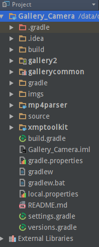

Intro
-----

Android版本 | 说明
--- | ---
android-4.2(含) | Gallery2 与 Camera 分开  
android-4.3 | Camera代码 已经迁移到 Gallery2工程里  
android-4.4_r0.7(含)及以后 | 开始创建Camera2项目，Gallery2删除camera相关代码

4.3的版本改动配置起来，比较方便  
所以本项目以"android-4.3.1_r1"版本为例，导入Android Studio。  

下载相关源码
-----------
[Gallery2(内含Camera)](https://android.googlesource.com/platform/packages/apps/Gallery2/+/android-4.3.1_r1)  
[mp4parser](https://android.googlesource.com/platform/external/mp4parser/+/android-4.3.1_r1)  
[xmptoolkit](https://android.googlesource.com/platform/external/xmp_toolkit/+/android-4.3.1_r1)  
源码已下载到[sources](./sources)文件夹

构建工程结构
-----------
**根据gallery2/Android.mk**  
```
LOCAL_STATIC_JAVA_LIBRARIES := android-support-v13  
LOCAL_STATIC_JAVA_LIBRARIES += com.android.gallery3d.common2  
LOCAL_STATIC_JAVA_LIBRARIES += xmp_toolkit  
LOCAL_STATIC_JAVA_LIBRARIES += mp4parser  
LOCAL_STATIC_JAVA_LIBRARIES += android-support-v8-renderscript
```
1. 引入v4，v13 support包
2. xmp_toolkit,mp4parser 这两个作为Java Librarys引入到工程中
3. 那个common lib 源码原位于gallery2下，现提出来与gallery2平级，作为Android Library导入
4. 指定java源文件 `java.srcDirs = ['src', 'src_pd']`
5. 指定rs源文件 `renderscript.srcDirs = ['src']`
6. so库使用这三个libjni_mosaic libjni_eglfence libjni_filtershow_filters，下面会说编译库的问题
7. 多语言上只保留了英文和中文

**构建完工程结构如下**  


编译so库
-------
#### 编译  
两个模块:jni 和 jni_mosaic。使用ndk-build工具编译  
```
（如果没有配置ndk的环境变量，需要使用全路径）/xxx/.../ndk-build NDK_PROJECT_PATH=xxx（编译的工程路径） APP_BUILD_SCRIPT=/xxx/.../Android.mk （mk文件路径）
```
jni的导入并没有改动太多代码，也暂不需要调试，所以没有集成到gradle中去编译。需要重新编译的时候，直接命令行吧。  

#### 编译报错解决
1. 在使用ndk-build编译native文件时, 报“undefined reference to ‘xxx某函数’”, 如果那个函数是__inline__ 修饰的,前面再加 static修饰  
2. 编译jni_mosaic 报 "error: use of undeclared identifier 'memset'或'memcpy'"。 注意 在SurfaceTextureRenderer.h 添加 #include <string.h>